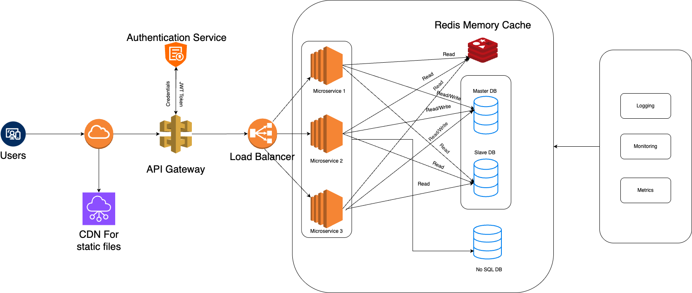

# Task 1
Task 1: Coding Challenge
Problem Statement: Write a function in your preferred programming language that takes an array of integers and returns the two numbers from the array whose sum is closest to zero.

**Example:**
*	Input: [-8, 4, 5, -10, 3]
*	Expected Output: [-8, 5]

**Include** :
*   Your complete solution code.
*   Time and space complexity analysis.


```python
def two_sum_closest_zero(arr):

    n = len(arr)
    if n < 2:
        return []
    arr.sort()

    left, right = 0, n - 1
    closest_pair = [arr[left], arr[right]]
    min_sum = arr[left] + arr[right]

    while left < right:
        current_sum = arr[left] + arr[right]

        if abs(current_sum) < abs(min_sum):
            min_sum = current_sum
            closest_pair = [arr[left], arr[right]]

        if current_sum < 0:
            left += 1
        else:
            right -= 1

    return closest_pair


if __name__ == "__main__":
    example_input = [-8, 4, 5, -10, 3]
    output = two_sum_closest_zero(example_input)
    print(f"Input: {example_input}\n\n Output: {output}")
```

**Approach**:
1. First, I have checked if the list has fewer than 2 elements. If so, it's not possible to find a pair, so return an empty list.
2. I have sorted the given input to use two-pointer technique to find the closest sum to zero.
3. In the two-pointer technique, I have initialized left at the beginning of the array (index 0) and right at the end of the array (index n-1). Afterwards, I have started calculating the current_sum using the two pointers. I have initialized the min_sum variable to track the closest sum to zero and update it whenever a new closer pair is found.
4. If the current sum is negative, I need to move it to a larger number to get closed to zero.
5. If the current sum is positive, I need to move it to a smaller number to get closer to zero.
6. continue the 4 and 5 steps until left cross the right value.
7. After compliting the loop, the closest_pair variable will be returned.
    
**Note**: we can solve the above problem using O(n²) approach for simplicity. However, the given approach is efficient and comes with optimised time complexity of O(n log n).

**Time Complexity:**
    In above code shorting takes O(n log n) and the two-pointer loop will take O(n). Overall: O(n log n).

**Space Complexity:**
 * In-place sorting uses O(1) extra space (ignoring input), or O(n) if the sort implementation requires it.
 * The algorithm itself uses O(1) additional space for pointers and variables.

# Task 2: System Design

Design a high-level architecture for a scalable web application to support millions of users concurrently. Provide:
* An architecture diagram (can be a sketch).
* Brief descriptions of each component in your system.
* Explanation of scalability, fault tolerance, and security considerations.

## An architecture diagram 
## Brief descriptions of each component

**1. Users (Clients)**
 - End-users on web or mobile clients issuing HTTP(S) requests.

**2. CDN for Static Files**

 - Serves images, JS/CSS, assets from edge locations.
 - Offloads static traffic from the origin sever and reduces latency.

**3. API Gateway**

 - Single entry point for all API calls.
 - Handles request routing, rate limiting, request/response transformations, and can integrate a Web Application Firewall (WAF).
 - Enforces authentication by forwarding credentials to the Authentication Service.

**4. Authentication Service**

 - Verifies user credentials (e.g. via OAuth, username/password, SSO).

 - Issues JSON Web Tokens (JWT) or other access tokens, which downstream services trust.

**5. Load Balancer**

 - Distributes incoming, authenticated requests evenly across different microservice instances.
 - Performs health checks and can automatically remove unhealthy instances from rotation.

**6. Microservices (1, 2, 3, …)**

 - Independently deployable units, each reasponsible for a specific domain such as Users, Orders, Payments.
 - Stateless in-memory, relying on external stores for persistence.
 - Auto-scale based on CPU/RAM/queue-length metrics.

**7. Redis Memory Cache**

 - In-memory key-value store for hot data (session state, user profiles, rate-limit , reading from databases).
 - Dramatically reduces database load and latency for read-heavy workloads.

**8. Master–Slave SQL Databases (PostgreSQL, MySQL)**

 - Master handles all writes and critical reads.
 - One or more Slaves replicate from Master and serve read queries.
 - Supports read-write splitting: microservices route writes to Master and heavy reads to Slaves.

**9. NoSQL Database**

 - Schema-flexible store for unstructured or semi-structured data (e.g. activity logs, user feeds, analytics).
 - Scales out by automatically sharding data across nodes.

**10. Monitoring & Logging**
 - Prometheus (metrics), Grafana (dashboards), ELK (logs) for observability

## Scalability
**Horizontal Auto-Scaling:**
 - All front-end (API Gateway, Load Balancer, Microservices) components run in an auto-scaling group (e.g. Kubernetes replicas or cloud auto-scaling groups). New instances spin up under load and terminate when idle.

**Read/Write Splitting & Replication:**
 - SQL master handles writes; read replicas serve analytics and UI reads, reducing contention on the writer.

**Sharding & Partitioning:**
 - NoSQL store shards large datasets so each node holds only a subset, distributing both storage and request load.

**CDN Edge Caching:**
 - Offloads static content and even some dynamic API responses (via cache rules), reducing origin request volume.

## Fault Tolerance
**Multi-AZ / Multi-Region Deployments:**
 - Deploy services across multiple Availability Zones (or Regions) to handle a single point of failure.

**Health Checks & Auto-Recovery:**
 - Load Balancers and orchestrators (e.g. Kubernetes) constantly probe instances; unhealthy pods or VMs are replaced automatically.

**Database Replication & Automatic Failover:**
 - SQL slaves can be promoted if the master fails; Redis can run in a clustered, replicated mode with automatic failover.

**Circuit Breakers & Timeouts:**
 - Each microservice call has timeouts and fallback behaviors to prevent cascading failures under downstream slowness.

## Security Considerations
**Network Segmentation & Least Privilege**

 - Place databases and caches in private subnets; only microservices can reach them.

 - Use IAM roles or service accounts with minimal permissions.


**Authentication & Authorization**

 - JWTs issued by the Authentication Service carry scopes/roles.

 - API Gateway validates tokens and checks scopes before routing.

**Input Validation & Sanitization**

 - Each service validates incoming data to prevent injection attacks (SQL/NoSQL injection, XSS).

**Web Application Firewall (WAF)**

 - Deployed in front of your API Gateway to block known bad actors, OWASP Top 10 threats, and rate-limit bruteforce attempts.

**Audit Logging & Monitoring**

 - Centralize logs (e.g. ELK/Stackdriver) and metrics (e.g. Prometheus/Grafana).

 - Set alerts on anomalous traffic, error spikes, or unexpected scaling events.

# Task 3

Analyze the following pseudocode and describe at least three significant improvements you'd make:
```
function processOrders(orders) {
  for i from 0 to orders.length - 1 {
    order = orders[i];
    total = 0;
    for j from 0 to order.items.length - 1 {
      total = total + order.items[j].price;
    }
    saveOrder(order.id, total);
  }
}
```

Provide clear explanations for each suggested improvement and how it benefits the overall efficiency and maintainability.

## Suggestions:

**1. Seperate method for Order total Calculation**
- The logic for calculating the total price of an order, currently it is nested within the `processOrders` function, it should be extracted into a separate function, such as calculateTotal(items). This involves moving the inner loop for summing item prices into its own function, which returns the total.
- Example: 
```
function calculateTotal(items) {
    total = 0;
    for each item in items {
        total = total + item.price;
    }
    return total;
}

function processOrders(orders) {
    for each order in orders {
        total = calculateTotal(order.items);
        saveOrder(order.id, total);
    }
}
```
- **Reason:** This change aligns with design principal (Single Responsibility) SOLID where each function performs one task only. By separating the total calculation the main function `prodcessOrders` will be cleaned and focused only on iterating orders and saving the results.

- **Benefits:**
    1. **Modularity:** The calculateTotal function can be used in other part of the code such as reporting.
    2. **Test:** A separate function can be easily tested using unit tests.
    3. **Readability:** Easy to read and understandable by other developers.

- **Efficiency:** Although the time complexity remains O(n*m) where n is the number of orders and m is the average number of items, the modular design allows for potential future optimizations, such as caching or parallel processing, to be applied to the calculateTotal function without affecting the rest of the code.

**2. Add Error Handling**
- The logic for the function doesn't handle any error or exceptions such as data validation for price value. So error handling can be implemented.
- Example: 
```
function processOrders(orders) {
  for each order in orders {
    if order.items is null or empty {
      continue;
    }
    total = 0;
    for each item in order.items {
      if item.price is null {
        continue;
      }
      total = total + item.price;
    }
    saveOrder(order.id, total);
  }
}
```
- **Reason:** This pseudocode assumes that all data is valid which is not realistic in real-world cases where data might be incomplete or malformed. Adding error handlers ensure the function doesn't crach or produce unexpected results.

- **Benefits:**
    1. **Predictability:** By implementing error handling, the code becomes more predictable, making it easier to debug and maintain.
    2. **Documentation:** The error handling logic serves as implicit documentation.
    3. **Efficiency:** Handling errors prevents unnecessary invalid data processing, saving computational resources and avoiding potential crashes that could intrupt the workflow.

**3. Asynchronous Processing**
If saveOrder involves I/O (e.g., database calls), process orders concurrently:
- Example
```
async def processOrders(orders):
  order_totals = calculateOrderTotals(orders)
  await asyncio.gather([saveOrderAsync(total.id, total.price) for total in order_totals])
```

- **Reason:** The original function `processOrders` uses synchronous processing blocks the execution thread while waiting for each `saveOrder` operation to complete, which is inefficient for I/O-bound tasks like database writes or network requests. Asynchronous processing allows the system to initiate multiple `saveOrder` operations simultaneously, significantly reducing total processing time when handling large datasets.

- **Benefits:**
    1. **Reduced Execution Time:** Running saveOrder operations concurrently, the total time to process all orders is reduced from the sum of individual saveOrder times to approximately the duration of the longest saveOrder operation (assuming sufficient system resources).
    2. **Better Resource Utilization:** The system can perform other tasks (e.g., processing additional orders or handling other requests) while waiting for I/O operations, optimizing CPU and network usage.


# Task 4: Cloud Architecture and DevOps
You have been asked to build and deploy a microservices-based application in a cloud environment (AWS, Azure, or GCP).

**Describe and/or include:**
* A high-level deployment architecture diagram.
* CI/CD pipeline setup for deployment automation.
* How you'd implement logging, monitoring, and auto-scaling.
* A secure authentication mechanism for APIs.

**Bonus:**
* Infrastructure as Code (IaC): Provide a small example using Terraform, AWS CloudFormation, or similar.
* Containerization: Explain how you would use Docker and orchestrate services with Kubernetes or a managed alternative.

## A Deployment architecture diagram 

## Architecture Overview

* **Microservices:** user-service, product-service, order-service (each a Flask app)

* **API Gateway:** AWS API Gateway or Nginx ingress in Kubernetes

* **Authentication:** JWT-based secured endpoints

* **Deployment:** Dockerized, deployed to AWS EKS (Elastic Kubernetes Service)

* **CI/CD:** GitHub Actions for build/test/deploy

* **IaC:** Terraform to provision AWS resources

* **Logging/Monitoring:** CloudWatch, Prometheus + Grafana

* **Auto-scaling:** EKS Horizontal Pod Autoscaler (HPA) based on CPU


**Project Folder Structure Example**
```
project/
├── microservice1/
│   ├── app.py
│   ├── requirements.txt
│   ├── Dockerfile
│   └── tests/
│       └── test_app.py
├── infrastructure/
│   ├── main.tf
│   ├── variables.tf
│   ├── outputs.tf
│   └── modules/
│       ├── vpc/
│       │   └── main.tf
│       ├── eks/
│       │   └── main.tf
│       └── alb/
│           └── main.tf
├── k8s/
│   ├── microservice1-deployment.yaml
│   ├── microservice1-service.yaml
│   ├── microservice1-hpa.yaml
│   └── ingress.yaml
├── .github/
│   └── workflows/
│       └── ci-cd.yml
└── README.md
```

**CI/CD Pipeline** 

GitHub Actions automates building Docker images, pushing them to Amazon ECR, and deploying to EKS. The pipeline triggers on code pushes to the main branch, ensuring continuous integration and deployment.

- Example:
```
name: CI/CD
on:
  push:
    branches:
      - main
jobs:
  build-and-deploy:
    runs-on: ubuntu-latest
    steps:
    - name: Checkout code
      uses: actions/checkout@v2
    - name: Set up Docker Buildx
      uses: docker/setup-buildx-action@v1
    - name: Login to AWS ECR
      uses: aws-actions/amazon-ecr-login@v1
      with:
        aws-access-key-id: ${{ secrets.AWS_ACCESS_KEY_ID }}
        aws-secret-access-key: ${{ secrets.AWS_SECRET_ACCESS_KEY }}
        region: ${{ secrets.AWS_REGION }}
    - name: Build and push microservice1
      run: |
        docker build -t ${{ secrets.ECR_REGISTRY }}/microservice1:${{ github.sha }} ./microservice1
        docker push ${{ secrets.ECR_REGISTRY }}/microservice1:${{ github.sha }}

    - name: Configure AWS credentials
      uses: aws-actions/configure-aws-credentials@v1
      with:
        aws-access-key-id: ${{ secrets.AWS_ACCESS_KEY_ID }}
        aws-secret-access-key: ${{ secrets.AWS_SECRET_ACCESS_KEY }}
        aws-region: ${{ secrets.AWS_REGION }}
    - name: Update kubeconfig
      run: aws eks update-kubeconfig --name my-eks-cluster
    - name: Deploy to EKS
      run: |
        kubectl set image deployment/microservice1 microservice1=${{ secrets.ECR_REGISTRY }}/microservice1:${{ github.sha }}
```


**Logging, Monitoring, and Auto-scaling**

**Logging**
- Container logs are shipped to CloudWatch using a fluentd daemonset deployed in the EKS cluster. Containers log to stdout/stderr, and fluentd forwards these to CloudWatch for centralized storage and analysis. Set up fluentd following the AWS CloudWatch Logging Guide.

**Monitoring**
- CloudWatch Container Insights is enabled for EKS to collect metrics such as CPU, memory, and network usage for pods and nodes. Alarms can be configured for thresholds, as described in CloudWatch Container Insights.

**Auto-scaling**
- Horizontal Pod Autoscaler (HPA): Scales pod replicas based on CPU or memory utilization, as shown in the microservice1-hpa.yaml example.
Cluster Autoscaler: Adjusts the number of worker nodes by scaling the EKS node group. Deploy the Cluster Autoscaler in the EKS cluster and configure it with appropriate IAM permissions, per the AWS EKS Autoscaling Guide.

**Secure Authentication**

- Amazon Cognito issues OAuth 2.0 tokens for API authentication. Microservices validate these tokens using libraries like PyJWT, ensuring secure access.

- Example:
```
resource "aws_cognito_user_pool" "main" {
  name = "my-user-pool"
  password_policy {
    minimum_length = 8
  }
}

resource "aws_cognito_user_pool_client" "client" {
  name         = "my-app-client"
  user_pool_id = aws_cognito_user_pool.main.id
  explicit_auth_flows = ["ALLOW_USER_PASSWORD_AUTH", "ALLOW_REFRESH_TOKEN_AUTH"]
}
```

**Infrastructure as Code**

Terraform defines AWS resources like VPC, EKS clusters, and Cognito user pools, enabling reproducible infrastructure setup.

- Example (main.tf):
```
provider "aws" {
  region = var.region
}

module "vpc" {
  source = "./modules/vpc"
  vpc_cidr = "10.0.0.0/16"
}

module "eks" {
  source = "./modules/eks"
  cluster_name = "my-eks-cluster"
  subnets = module.vpc.private_subnets
  node_group_desired_size = 2
  node_group_max_size = 3
  node_group_min_size = 1
}

module "alb" {
  source = "./modules/alb"
  vpc_id = module.vpc.vpc_id
  subnets = module.vpc.public_subnets
}
```
- Example (modules/eks/main.tf):
```
resource "aws_eks_cluster" "main" {
  name     = var.cluster_name
  role_arn = aws_iam_role.eks_cluster.arn
  vpc_config {
    subnet_ids = var.subnets
  }
}

resource "aws_eks_node_group" "main" {
  cluster_name    = aws_eks_cluster.main.name
  node_group_name = "my-node-group"
  node_role_arn   = aws_iam_role.eks_nodes.arn
  subnet_ids      = var.subnets
  scaling_config {
    desired_size = var.node_group_desired_size
    max_size     = var.node_group_max_size
    min_size     = var.node_group_min_size
  }
}

resource "aws_iam_role" "eks_cluster" {
  name = "eks-cluster-role"
  assume_role_policy = jsonencode({
    Version = "VERSION"
    Statement = [{
      Action = "sts:AssumeRole"
      Effect = "Allow"
      Principal = {
        Service = "eks.amazonaws.com"
      }
    }]
  })
}

resource "aws_iam_role" "eks_nodes" {
  name = "eks-nodes-role"
  assume_role_policy = jsonencode({
    Version = "VERSION"
    Statement = [{
      Action = "sts:AssumeRole"
      Effect = "Allow"
      Principal = {
        Service = "ec2.amazonaws.com"
      }
    }]
  })
}
```


**Containerization**

Each microservice is containerized with Docker and orchestrated by EKS, simplifying deployment and scaling compared to Kubernetes.

- Example:
```
FROM python:3.8-slim
WORKDIR /app
COPY requirements.txt .
RUN pip install -r requirements.txt
COPY . .
CMD ["python", "app.py"]
```